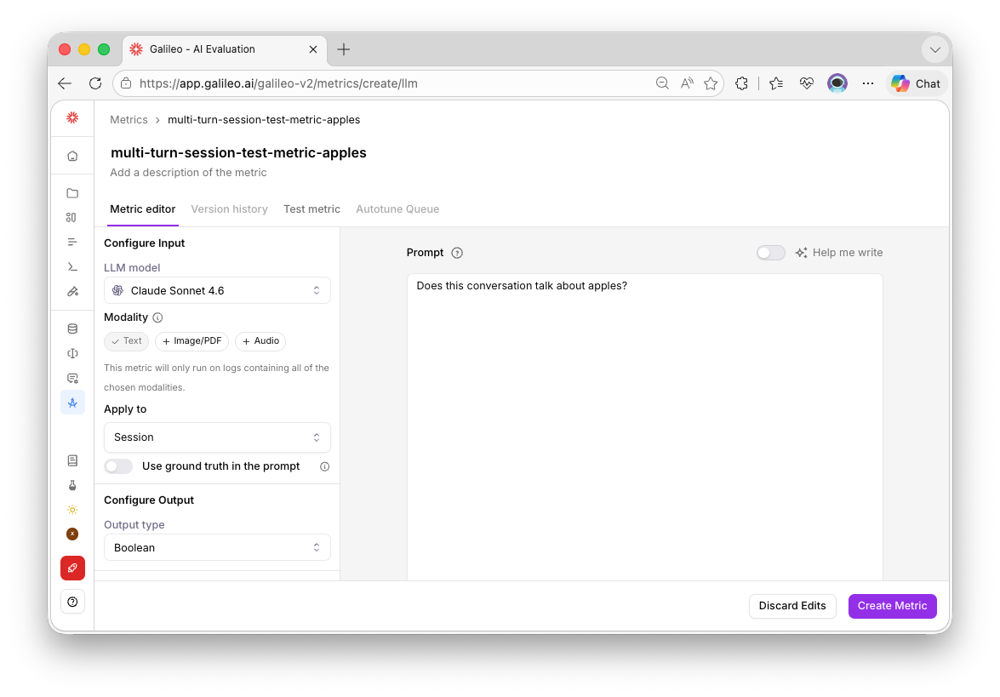
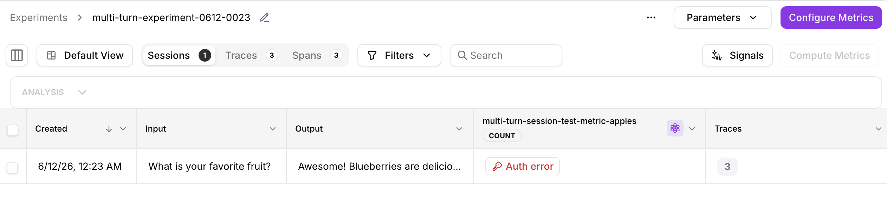
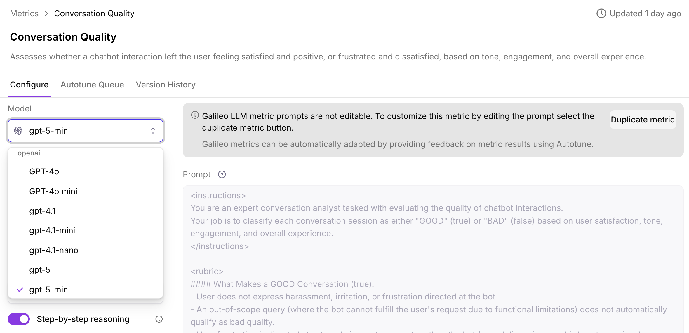

# Multi-Turn Experiment Example

The example in this folder demonstrates how to use [create_experiment](https://agent-observability-docs.splunk.com/sdk-api/python/reference/experiments#create_experiment) to compute a session-level metric for a multi-turn conversation. 

## Setup Instructions

### 1. Create and Activate Virtual Environment

```bash
# Navigate to the example folder
cd python/experiments/multi-turn

# Create virtual environment
python -m venv venv

# Activate virtual environment
source venv/bin/activate
```

### 2. Install Dependencies

Run

```bash
pip install -r requirements.txt
```

### 3. Configure Environment Variables

Your `.env` should look like this. Feel free to follow the `.env.example` and enter your credentials

```bash

# Required: Your Splunk AO API key
SPLUNK_AO_API_KEY="your-splunk-ao-api-key"

# Required: Splunk AO project name
SPLUNK_AO_PROJECT="your-splunk-ao-project"

# Provide the console url below if you are not using app.galileo.ai
# SPLUNK_AO_CONSOLE_URL="your-splunk-ao-console-url"
```

### 4. Add Integration in Splunk AO Console

The session-level metric in this example uses an LLM. 

Make sure that you've configured a valid LLM integration in the Splunk AO console.

Related documentation: [Configure an LLM integration](https://agent-observability-docs.splunk.com/getting-started/evaluate-and-improve/evaluate-and-improve#configure-an-llm-integration)

## Basic Example

Run the basic example:

```bash
python basic-example.py
```

The `METRIC_NAME` variable in this script cites a session-level metric.

Pre-defined session-level metrics include:

- `SplunkAOEvaluators.conversation_quality`
- `SplunkAOEvaluators.action_completion`
- `SplunkAOEvaluators.action_advancement`
- `SplunkAOEvaluators.agent_efficiency`
- `SplunkAOEvaluators.context_adherence`
- `SplunkAOEvaluators.context_relevance`
- `SplunkAOEvaluators.tool_error_rate`

Related documentation: [Metrics Comparison](https://agent-observability-docs.splunk.com/concepts/evaluators/evaluator-comparison)

Optionally, you can define your own custom session-level metric in the Splunk AO Console UI, and then add the custom metric name. 



## Troubleshooting

Visit the "Sessions" tab of the Experiment in the Splunk AO Console to confirm the status of the metric computation.



If you see an auth error, go to the metric details and make sure that a [valid integration](https://agent-observability-docs.splunk.com/getting-started/evaluate-and-improve/evaluate-and-improve#configure-an-llm-integration) has been configured. 



