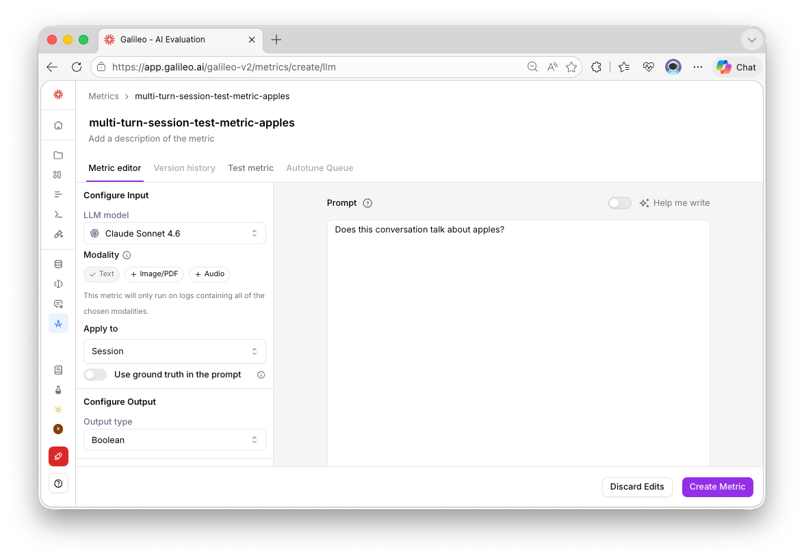
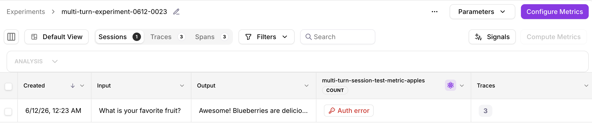
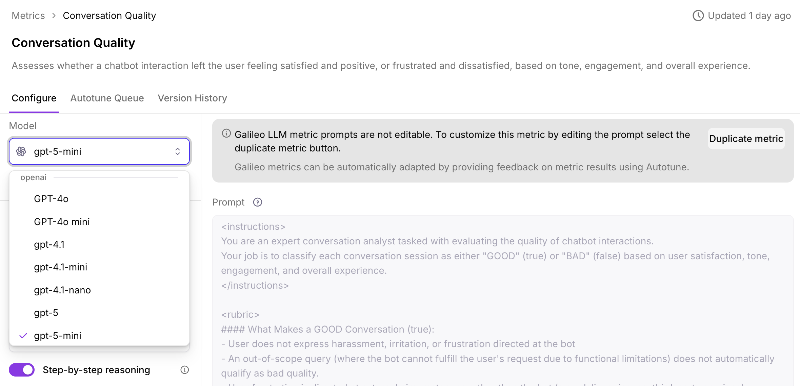

# Multi-turn experiment example

This example uses the `splunk-ao` SDK to create an experiment, upload a manually logged multi-turn session, register a
Splunk AO session evaluator, and poll until its platform-computed result is available. It is a manual logging workflow,
not a `run_experiment` prompt-template or runner-function example.

## Setup Instructions

### 1. Create and activate a virtual environment

```bash
cd examples/experiments/multi-turn

# Create virtual environment
python -m venv venv

# Activate virtual environment
source venv/bin/activate
```

### 2. Install dependencies

Run

```bash
pip install -r requirements.txt
```

### 3. Configure environment variables

Copy `.env.example` to `.env`, choose either the Standalone or O11y block, and enter your credentials. Do not mix the
two deployment modes.

```shell
cp .env.example .env
```

O11y requires `SPLUNK_AO_REALM` and `SPLUNK_AO_O11Y_TOKEN` because this example emits telemetry. Set
`SPLUNK_AO_O11Y_API_TOKEN` as well when CRUD operations use a dedicated token. Standalone requires
`SPLUNK_AO_API_KEY` and `SPLUNK_AO_CONSOLE_URL`.

### 4. Configure an LLM integration

The session-level metric in this example uses an LLM.

Make sure that you've configured a valid LLM integration in the Splunk AO console.

Related documentation: [Configure an LLM integration](https://agent-observability-docs.splunk.com/getting-started/evaluate-and-improve/evaluate-and-improve#configure-an-llm-integration)

## Basic Example

Run the basic example:

```bash
python basic-example.py
```

The `METRIC_NAME` variable selects a session-level evaluator. These evaluators run in Splunk AO after the session is
ingested; they are not `LocalMetricConfig` callables.

Pre-defined session-level metrics include:

- `SplunkAOEvaluators.conversation_quality`
- `SplunkAOEvaluators.action_completion`
- `SplunkAOEvaluators.action_advancement`
- `SplunkAOEvaluators.agent_efficiency`
- `SplunkAOEvaluators.context_adherence`
- `SplunkAOEvaluators.context_relevance`
- `SplunkAOEvaluators.tool_error_rate`

Related documentation: [Metrics Comparison](https://agent-observability-docs.splunk.com/concepts/evaluators/evaluator-comparison)

Optionally, you can define your own custom session-level metric in the Splunk AO Console UI, and then add the custom metric name.



## Troubleshooting

Visit the "Sessions" tab of the Experiment in the Splunk AO Console to confirm the status of the metric computation.



If you see an auth error, go to the metric details and make sure that a [valid integration](https://agent-observability-docs.splunk.com/getting-started/evaluate-and-improve/evaluate-and-improve#configure-an-llm-integration) has been configured.


